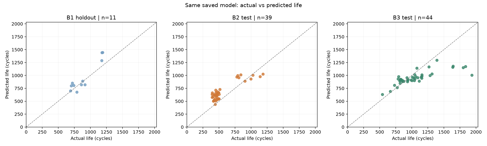
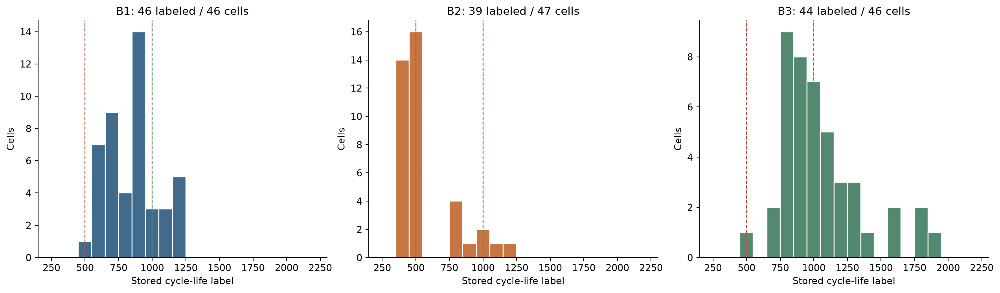
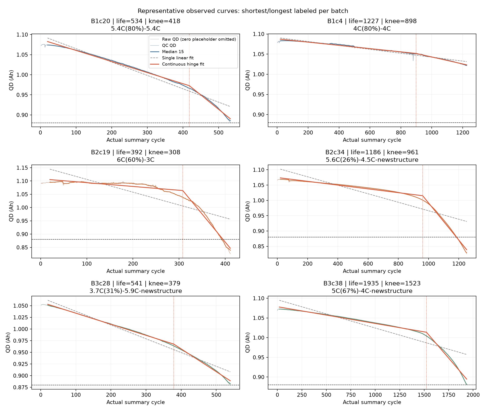
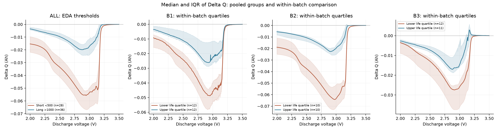
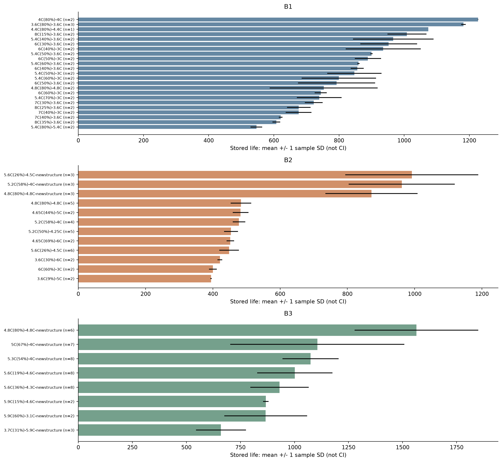

# ESS 배터리 수명 예측

ESS의 배터리 교체와 상태 점검을 미리 계획하기 위해 초기 관측으로 수명을 예측합니다.
처음100사이클의 용량 곡선과 충전 전류를 사용해 제공된 전체 `cycle_life`를 예측하는 회귀 문제입니다.

## 프로젝트 개요

- 데이터: MIT-Stanford Battery Dataset, [과제 원본 Kaggle](https://www.kaggle.com/datasets/itshpark/data-driven-prediction-of-battery-cycle).
- 학습: Batch1=2017-05-12, 유효 수명46개 중 학습35개/holdout11개.
- 필수 평가: Batch2=2018-02-20, 유효 수명39개. 추가 평가: Batch3=2018-04-12,44개.
- 제외: 2018-04-03. 수명 결측10개를 관측 길이로 채우지 않습니다.
- 태스크: Regression. 입력은 초기 특징, 정답은 원본 MAT의 `cycle_life`입니다.

## 모델 비교와 선택

| 모델 | CV MAPE (%) | 반복 CV 표준편차 (%p) | Valid MAPE (%) | B2 MAPE (%) | B3 MAPE (%) |
| --- | --- | --- | --- | --- | --- |
| OLS: ΔQ 로그분산 단독 | 7.510 | 0.176 | 18.203 | 28.864 | 12.595 |
| Ridge: 기존2변수 | 7.102 | 0.222 | 16.153 | 33.561 | 13.742 |
| CatBoost: 추가2변수 | 8.151 | 0.239 | 5.536 | 29.773 | 14.161 |
| Voting: 추가2변수 | 6.452 | 0.481 | 9.956 | 30.275 | 13.337 |
| Stacking: 기존2변수 | 6.890 | 0.146 | 14.301 | 29.320 | 12.987 |
| **Stacking: 추가2변수 (최종)** | 6.645 | 0.129 | 11.385 | 27.717 | 12.780 |

- **선택 근거:** 추가 전 Stacking보다 CV가0.245%p, Valid가2.916%p, B2가1.603%p 개선됐습니다. 변수 추가 효과는 CV3회 모두 같은 방향으로 나타났습니다.
- **안정성:** Voting의 평균 CV 오차는 더 낮았지만, 최종 Stacking은 반복 CV 변동이 작고 변수 추가 효과가 일관됐습니다. B2에서 관찰한 오차도 비교표의 모델 중 가장 낮았습니다.
- **과적합 검토:** Stacking의 외부 CV−학습 재대입 MAPE 차이는1.210%p였습니다. CatBoost 추가 모델의5.200%p보다 작지만, 이것만으로 과적합이 없다고 단정하지 않았습니다.

처음에는 **작은 학습 표본·낮은 비용·빠른 학습·간단한 조정**을 고려해 Ridge를 선택했습니다. 추가 학습에서 OLS, XGBoost·CatBoost·LightGBM·Gradient Boosting, Voting과 Stacking을 비교했습니다. 반복 실험에서 Stacking의 개선과 안정성을 관찰해 **귀납적으로 최종 모델을 Stacking으로 변경**했습니다.

표의 모델은 같은 B1 분할·3반복 그룹 CV로 비교했습니다. MAPE는 낮을수록 좋습니다.

[전체 동일 조건 비교](results/runs/top2_feature_comparison_20261002/model_comparison.csv) · [XGBoost·LightGBM 등 앞선 모델군 비교와 별도 탐색 조건](results/runs/boosting_selection_20261002/README.md)

## 성능 결과

| 구분 | MAPE (%) | 비고 |
| --- | --- | --- |
| Train (Batch 1 CV) | 6.645 | B1 그룹 OOF CV; 낮을수록 예측이 더 정확함 |
| Valid (Batch 1 Hold-out) | 11.385 | B1 holdout; 동일 저장 모델 |
| Test (Batch 2) | 27.717 | 필수 최종 배치 평가 |
| Gap (Train-Valid) | 4.740 | Valid−Train (%p); (+) 과적합/집단 차이 검토 |
| Gap (Valid-Test) | 16.332 | Test−Valid (%p); (+) 배치 간 일반화 저하 검토 |
| Gap (Target-Test) | 18.617 | Test−9.1 (%p); 논문 Target과 다른 실험 구성 |
| Test (Batch 3) | 12.780 | 동일 모델 추가 평가 |
| Gap (Batch2-Batch3) | -14.937 | B3−B2 (%p); (+) B3에서 오차 증가 |
| Gap (Target-Test) [Batch 3] | 3.680 | B3−9.1 (%p); 추가 참고 비교 |



- **기존 Ridge 대비:** Valid16.153→11.385%, B2 33.561→27.717%, B3 13.742→12.780%로 개선됐습니다. 초기 Ridge의 CV는 반복하지 않은 선택 CV여서 위 반복 CV와 직접 대조하지 않았습니다.
- **남은 차이:** B2는 논문 Target9.1%보다18.617%p 높습니다. 단순 기준 모델72.400%보다 개선됐지만 배치 간 일반화 문제가 남았습니다.

B2/B3는 EDA와 여러 모델 비교에 이미 사용했습니다. 이번 결과는 개발 과정에서 관찰한 배치 평가이며, 엄격한 미관측 테스트 성능을 확인하려면 새로운 배치가 필요합니다.

[요구 형식 성능표](results/model_performance.csv) · [보조 지표](results/model_metrics.csv) · [성능 보고서](results/performance_report.md)

**MAPE가 낮을수록 수명 예측이 더 정확합니다.** `100−MAPE`를 Accuracy로 해석하지 않습니다.

성능 행은%, Gap 행은%p입니다. Gap은 Valid−Train, Test−Valid, Test−9.1로 계산하며, 양수는 뒤 평가의 오차 증가를 뜻합니다.

<details>
<summary>지표 선택 이유·MAE/RMSE·중앙 수명 기준 비교</summary>

| 지표 | 사용하는 이유 |
|---|---|
| **주 지표: MAPE (%)** | 수명이 다른 셀의 상대 오차를 비교하고 과제의 논문 Target9.1%와 대조합니다. |
| 보조: MAE (cycle) | 평균 몇 사이클 틀렸는지 보여줘 운영 계획에 필요한 오차 크기를 파악합니다. |
| 보조: RMSE (cycle) | 큰 오차의 영향을 더 크게 반영해 위험한 예측 사례를 확인합니다. |

| 평가 구분 | MAE (cycle) | RMSE (cycle) | 중앙 수명 기준 MAPE (%) |
| --- | --- | --- | --- |
| Train (Batch 1 CV) | 54.421 | 71.498 | 19.887 |
| Valid (Batch 1 Hold-out) | 107.739 | 134.866 | 16.488 |
| Test (Batch 2) | 138.527 | 154.494 | 72.400 |
| Test (Batch 3) | 159.621 | 249.636 | 20.232 |

중앙 수명 기준값은 CV에서 각 fold의 학습 정답 중앙값, 나머지 평가에서는 B1 학습35개의 중앙값입니다.

</details>

## 파이프라인


‘파일 확인’은 지정한 배치를 읽었는지, ‘셀 ID 확인’은 특징과 정답이 같은 셀인지 확인하는 작업입니다. 예를 들어 B1c20의 특징에 B1c21의 수명을 연결하면 안 됩니다. [단계별 설명](docs/pipeline.md)

## 피처 엔지니어링과 학습 방법

### 최종 입력과 선정 이유

| 입력 변수 | 계산 | 선정 이유 |
|---|---|---|
| `dq100_10_log_variance` | `log10(var(Q100(V)−Q10(V), ddof=1))` | 전압별 곡선 변화의 퍼짐을 요약합니다. 수명과의 음의 관계가 B1·B2·B3에서 유지돼 기본 신호로 선정했습니다. |
| `cycle10_rms_c_timeweighted` | 활성 충전 구간의 시간 가중 RMS 전류 | 최고 C-rate 하나로 놓치는 실제 전류 크기와 유지 시간 비중을 반영합니다. 배치별 예측 관계가 달라 보조 입력으로 해석했습니다. |
| **추가: `dq100_10_q05_ah`** | ΔQ(V)의5% 분위수, Ah | 큰 음의 변화 구간을 한 점의 최솟값보다 덜 민감하게 요약합니다. B1 학습35개의 수명 상관은 **r=+0.882**, 추가 후보 중1위였습니다. |
| **추가: `dq100_10_mean_ah`** | ΔQ(V)의 부호 있는 평균, Ah | 분산에 담기지 않는 곡선 전체의 이동량을 보완합니다. B1 학습35개의 수명 상관은 **r=+0.847**, 추가 후보 중2위였습니다. |

cycle100까지의 관측으로 제공된 전체 `cycle_life`를 예측합니다. 최종 입력은 **기존2개 + 추가2개, 총4개**입니다. ID·배치·프로토콜은 연결·분할에만 사용하고, 후기 Knee·최종 용량·전체 관측 길이·IR은 입력에서 제외했습니다.

추가2개는 같은 전압축의 기존 ΔQ에서 계산한 파생 통계이므로 새로운 센서가 필요 없습니다. 값이 더 음수이면 해당 전압에서 방전 용량 변화가 더 큽니다. `capacity_mad_relative`는 최초 CV에서 추가 예측 가치가 확인되지 않아 최종 입력에서 제외했습니다.

**상관만으로 채택하지 않았습니다.** IR을 제외한9개 후보에서 매 CV 학습 부분의 절대 Pearson 상관으로2개를 고른 뒤 반복 그룹 CV에서 개선을 확인했습니다. 최종 학습35개가 고른2개는 q05와mean이며, 작은 내부 학습 부분에서는 다른 후보가 선택될 수 있습니다. 최종 추론에 쓰는 입력은4개입니다.

추가2개끼리의 상관은 **r=0.993**으로 매우 높습니다. 독립적인 물리 신호로 해석하지 않고, 기저 Ridge와 메타 Ridge의 L2 규제 및 반복 CV로 예측 안정성을 확인했습니다. 개선 폭은 작으며 통계적 유의성을 확정한 결과는 아닙니다.

[특징 추출 노트북](notebooks/02_feature_engineering.ipynb) · [학습35개 후보 순위](results/final_feature_ranking.csv) · [추가 변수 비교](results/runs/top2_feature_comparison_20261002/findings.md)

### 최종 모델 구조

| 구성 | 입력·설정 |
|---|---|
| OLS 기저 모델 | ΔQ 로그분산·q05·mean,3개 입력 |
| Ridge 기저 모델 | 최종4개 입력, `alpha=1`, `solver=svd` |
| XGBoost 기저 모델 | 최종4개 입력, 깊이3·트리250·학습률0.03·`min_child_weight=5`·`reg_lambda=10` |
| 메타 모델 | 기저3모델의 그룹 OOF 예측, 표준화 + Ridge(`alpha=1`) |

**구조:** OLS·Ridge·XGBoost의log10 수명 예측 → 표준화 → 메타 Ridge → 원래 수명으로 역변환.

기저 모델의 선형 추세와 비선형 반응을 결합하되, 메타 모델은 학습 셀에 그대로 재대입한 기저 예측 대신 **그룹 OOF 예측**으로 학습했습니다.

[Stacking 구현](src/stacking.py) · [학습 실행](src/train_stacking.py) · [실행 노트북](notebooks/03_modeling.ipynb) · [최종 설정](models/metadata.json) · 저장 모델: `models/stacking.joblib`

<details>
<summary>학습 비용과 최종 실행 기록</summary>

- **비용·효율:** 초기 Ridge의 학습 단계는 약0.213초였습니다. 최종 Stacking은 더 많은 학습 비용을 받아들이고 예측 개선을 우선했습니다. GPU나 유료 API는 사용하지 않았습니다.

이번 로컬 CPU 실행은 반복 CV·내부 탐색·최종 학습을 포함해 **15.06초, 2,512회 fit**을 수행했습니다. 초기 Ridge와 탐색 예산이 달라 단순한 모델 속도 비교로 해석하지 않았습니다. [실측 실행 기록](results/training_runtime.json)

</details>

### 학습·검증·평가 방법

| 역할 | 배치 | 셀 수 | 사용 범위 |
|---|---|---:|---|
| 학습·CV | B1 | 35 | 18개 프로토콜 그룹, 3반복×5fold CV |
| 별도 검증 | B1 holdout | 11 | 학습과 분리된 5개 프로토콜 그룹 |
| 필수 테스트 | B2 | 39 | 저장 모델 평가 |
| 선택적 추가 테스트 | B3 | 44 | 동일 저장 모델 평가 |

1. B1을 충전 프로토콜 그룹으로 학습35개/holdout11개로 분리했습니다. 같은 프로토콜의 반복 셀이 양쪽에 섞이지 않게 했습니다.
2. 학습35개에서 그룹5fold를3회 반복했습니다. 후보 순위·표준화·XGBoost12설정의 내부3fold 탐색과 메타 OOF 학습은 각 학습 부분 안에서 수행했습니다.
3. `log10(cycle_life)`를 학습하고 `10**예측`으로 역변환해 지표를 계산했습니다. Train은 반복별 OOF 점수의 평균입니다. 독립 학습 셀은35개이며105개가 아닙니다.
4. 최종 학습35개로 만든 **동일 저장 모델**을 B1 holdout·B2·B3에 적용했습니다. 해당 실행의 평가 단계에서는 모델을 재학습하지 않았습니다.

## EDA

### Cycle Life 분포



| 배치 | 유효 수명 n | 중앙값 (cycle) | 단수명 <500 | 장수명 >1,000 |
|---|---:|---:|---:|---:|
| B1 | 46 | 858.5 | 0 (0.0%) | 10 (21.7%) |
| B2 | 39 | 472.0 | 28 (71.8%) | 3 (7.7%) |
| B3 | 44 | 1,005.5 | 0 (0.0%) | 23 (52.3%) |

- **핵심 발견:** 학습 배치와 평가 배치의 수명 분포가 달라, 배치 간 일반화를 별도로 평가해야 합니다.

히스토그램은 150~2,300사이클 범위로 표시했습니다. 유효 수명129개의 실제 범위는392~1,935사이클입니다. 표의 비율은 각 배치의 유효 수명 수를 기준으로 계산했습니다.

- B1은 중앙부에 모이고 B2·B3는 오른쪽 꼬리가 긴 분포입니다. B2는 단수명, B3는 장수명 비중이 큽니다.
- B2의 최단 셀은 B2c19(392사이클)입니다. 단수명28개는 배치 내 다수이며 IQR 하단 이상치가 아닙니다. 짧다는 이유만으로 측정 오류로 판단하지 않았습니다.

### 열화 곡선 분석



- **핵심 발견:** 열화는 일정한 속도로 진행되지 않으며, 초기 총용량 변화가 작아도 후기 감소가 가속될 수 있습니다.

- 배치별 최단·최장 수명 셀을 대표로 골라 Qd 추이를 비교했습니다. 상대적으로 짧은 수명 셀에서 후기 용량 감소가 더 빨랐습니다.
- 분절 회귀로 탐색한 Knee 후보의 배치별 중앙값은 B1 611 / B2 355 / B3 832사이클입니다. 이 집계는 수명 결측 셀도 포함한 전체 곡선 EDA 기준입니다.
- B2c19의 Knee 후보는308사이클, B2c34(1,186사이클)의 후보는961사이클입니다. Knee는 전체 곡선에서 사후 탐색한 후보이며 초기 예측 입력에 넣지 않았습니다.

- B1c0는 단일 직선 대비 SSE 개선이13.9%로 후보 기준20%를 충족하지 않아 불확실로 분류했습니다. 모든 셀에서 Knee가 확정됐다는 뜻은 아닙니다.

### ΔQ(V) 곡선 분석



- **핵심 발견:** 초기 총용량보다 전압별 용량 곡선의 변화가 수명을 구분하는 강한 신호였습니다. 곡선 형태를 로그 분산으로 요약했습니다.

- 같은 전압축(3.5→2.0V, 1,000점)에서 `ΔQ(V)=Q100(V)−Q10(V)`를 계산했습니다.
- 단수명군(<500)의 ΔQ 로그 분산 중앙값은−3.446, 장수명군(>1,000)은−4.311입니다. 단수명군에서 전압별 변화 폭이 더 컸습니다. 단수명군은 B2에만 있어 전체 장단수명 비교에는 배치 효과도 포함됩니다.

### 충전 속도(C-rate)와 수명의 관계



- **핵심 발견:** 최고 C-rate 하나로 수명을 설명하기 어렵습니다. 실제 전류 크기와 적용 시간 비중을 반영하는 시간 가중 RMS를 후보로 선정했습니다. 상관을 충전 조건의 인과 효과로 단정하지 않았습니다.

- B1의 `5.4C(60%)-3.6C` 평균 수명은859.5사이클(n=2), `5.4C(80%)-5.4C`는546.5사이클(n=2)입니다. 초기 C-rate가 같아도 전환 SOC와 후반 전류가 다르면 수명이 달랐습니다.
- cycle10 실측 RMS와 수명의 Pearson r은 B1−0.891 / B2−0.207 / B3−0.507입니다. 관계의 강도가 배치별로 달랐습니다.

### 추가 확인: 수명 상관과 다중공선성

| 초기 특징 | 전체129개 | B1 | B2 | B3 |
|---|---:|---:|---:|---:|
| ΔQ 로그 분산 | −0.851 | −0.886 | −0.902 | −0.702 |
| cycle10 시간 가중 RMS | −0.432 | −0.891 | −0.207 | −0.507 |
| 상대 용량 MAD | −0.522 | −0.487 | −0.490 | −0.350 |

- **핵심 발견:** 수명과의 개별 상관이 높아도 중복 변수를 늘리지 않았고, 추가 채택 여부는 B1 내부 CV에서 예측 개선을 확인했습니다.

표의 값은 원본 `cycle_life`와 각 초기 특징의 Pearson 상관계수입니다.

- ΔQ 로그 분산은 세 배치에서 일관된 음의 관계를 보였습니다. 로그 절대 최솟값은 로그 분산과 r≈0.968로 중복돼 함께 사용하지 않았습니다.
- 초기 B1 학습35개에서3후보를 함께 진단한 VIF는 ΔQ 4.881 / RMS 5.130 / MAD 1.481입니다. 연관된 입력의 계수 불안정을 줄이기 위해 Ridge의 L2 규제를 적용했습니다.

상세 계산과 도표는 [EDA 노트북](notebooks/01_EDA.ipynb), [상관 분석 결과](results/eda/feature_plots/feature_target_correlations.csv), [DAY1 보고서](docs/DAY1_EDA_Modeling_Strategy.pdf)에 정리했습니다.

**Batch 2는 분포가 다른 배치에서도 예측이 유지되는지 확인하기 위해 최종 평가에 사용했습니다.** 분포 차이만으로 유효 단수명 셀을 제거하지 않았습니다. B2/B3를 DAY1 EDA에서 확인한 이력은 분석 한계로 남겼습니다.

## 파일 구조

```text
├── data/
│   ├── README.md                  # 원본 링크·파일명·배치 방법
│   ├── raw/                       # 원본 MAT 로컬 위치, Git 제외
│   └── processed/cell_features.csv
├── notebooks/
│   ├── 01_EDA.ipynb
│   ├── 02_feature_engineering.ipynb
│   └── 03_modeling.ipynb
├── src/
│   ├── preprocess.py              # 기존 원본 읽기
│   ├── features.py                # 초기 특징·후보 추출
│   ├── splits.py                  # 충전 프로토콜 그룹 분할
│   ├── train.py                   # 설정한 모델 학습
│   ├── stacking.py                # 기저 모델·OOF 메타 학습
│   ├── train_stacking.py          # 반복 CV·최종 모델 저장
│   ├── evaluate.py                # 저장 모델 평가·지표
│   ├── report.py                  # 도표·오류 분석·보고서
│   ├── pipeline.py                # 단계별 실행
│   └── eda/                       # 기존 DAY1 분석 코드
├── config/model.json
├── results/                       # 기존 EDA와 실행 후 결과
├── models/                        # 학습 실행 후 저장 모델
├── docs/
├── requirements.txt
└── README.md
```

## 환경과 실행

Python3.11 이상을 권장합니다. 원본 특징 추출·모델 학습·Batch 1 Hold-out 및 Batch 2/3 평가·보고서 생성을 수행했습니다. 아래 명령으로 각 단계를 재현할 수 있습니다.

노트북은 `01_EDA → 02_feature_engineering → 03_modeling` 순서로 구성했습니다. 노트북이 `src`의 파이프라인을 실행하므로 `.py`를 별도로 실행할 필요는 없습니다. `03_modeling.ipynb`는 실행할 때마다 새 결과 폴더를 만듭니다. CLI에서 이미 끝낸 학습·평가를 같은 폴더에 다시 실행하면 덮어쓰기 방지 오류가 발생합니다.

```bash
git clone --branch submission/day2-reviewed https://github.com/dwk0714/ESS_Analytics_SKALA.git
cd ESS_Analytics_SKALA
python -m venv .venv
source .venv/bin/activate
pip install -r requirements.txt
jupyter lab
```

원본 전체 재현은 [데이터 안내](data/README.md)에 따라 MAT를 준비합니다. 현재 기존 `../archive`를 그대로 지정할 수 있습니다.

```bash
# 전체 EDA: 원본 필요, 모델 학습 없음
python -m src.pipeline eda --raw-dir ../archive
# 모델용 초기 특징: 원본 필요
python -m src.pipeline features --raw-dir ../archive
# 새 실험 재현: 동봉 특징 CSV를 사용하고 별도 결과 폴더에 저장
python -m src.pipeline train --run-dir results/runs/reproduction
python -m src.pipeline evaluate --run-dir results/runs/reproduction --include-b3
python -m src.pipeline report --run-dir results/runs/reproduction
```

위 명령은 노트북 대신 터미널로 실행하는 방법입니다. B3 평가를 생략하려면 첫 평가 명령에서 `--include-b3`를 뺍니다. 새 실험마다 다른 폴더 이름을 정하고 학습·평가·보고서에 같은 `--run-dir`를 지정합니다. 기존 평가 결과를 덮어쓰지 않습니다. 각 실행의 변수·조정값 선택은 B1 학습 부분에서만 수행합니다.

## 오류 분석

각 평가셋의 APE 상위3개 셀을 비교했습니다. 아래는 평가셋별 최대 상대 오차 사례입니다.

| 평가셋 | 셀 | 실제 수명 | 예측 수명 | APE (%) | 방향 |
| --- | --- | --- | --- | --- | --- |
| B1 Hold-out | B1c1 | 1179 | 1439.916 | 22.130 | 과대 예측 |
| B2 | B2c15 | 396 | 661.520 | 67.051 | 과대 예측 |
| B3 | B3c38 | 1935 | 1006.499 | 47.985 | 과소 예측 |

- **공통점:** B2 상위3개(B2c15·B2c6·B2c18)는 모두500사이클 미만이며 과대 예측했습니다. B3 상위3개는1,801~1,935사이클의 장수명 셀을 과소 예측했습니다.
- **원인 가설:** B1에는500미만 단수명 셀이 없고, 특징–수명 관계와 라벨 종료 규칙도 배치별로 다릅니다. 입력이 학습 범위 안이어도 예측 관계가 유지된다는 보장은 없습니다.
- **개선 방향:** 일관된 종료 기준과 더 넓은 수명 범위를 가진 학습 자료를 확보하고, 새 외부 배치에서 개선 효과와 예측 불확실성을 검증합니다.

[전체9개 오류 사례](results/error_analysis.md) · [셀별 예측](results/predictions.csv)

## Troubleshooting

| 관찰한 문제 | 점검·변경 | 판단 근거와 남은 한계 |
|---|---|---|
| 최초 Ridge의 CV보다 Valid·B2 오차가 컸음 | 기존2개 요약 특징만으로 충분한지 의심하고, OLS·Boosting·앙상블과 추가 초기 변수를 순차 비교 | 효율 중심의 최초 선택에서 출발했지만, 반복 실험의 지표를 근거로 귀납적으로 Stacking을 선택했습니다. |
| ΔQ 로그분산만으로 곡선의 방향·이동량을 놓칠 가능성 | B1 학습 부분에서 수명 상관이 높은 q05·mean을 추가 | 추가 전 Stacking 대비 CV3회 모두 개선됐습니다. 두 변수의 높은 상호 상관과 작은 개선 폭은 한계로 남겼습니다. |
| **RMS와 수명의 관계가 B1·B2에서 크게 달랐음** | 배치별 상관·분포·오류를 다시 비교 | Pearson r은 **B1−0.891→B2−0.207**입니다. B1에서 강한 RMS 관계가 B2에서 약해져 성능 격차에 영향을 줬을 가능성이 있습니다. RMS 중앙값 자체는 약3.121/3.134로 비슷하므로, 특히 **예측 관계의 차이**로 해석했습니다. |
| B2의 단수명 영역에서 과대 예측이 남음 | ΔQ 계산을 원본과 재대조하고 수명 범위·라벨을 점검 | 원본 재계산은 일치했습니다. B1의 <500셀은0개, B2는28개이고 종료 규칙도 달라 RMS 하나만으로 원인을 확정하지 않았습니다. |

[동일 조건 모델·변수 비교](results/runs/top2_feature_comparison_20261002/model_comparison.csv) · [초기 Ridge 보관 결과](results/runs/ridge_baseline_before_stacking_20261002/results/model_performance.csv)

## ESS 도메인 해석

- **의사결정 활용:** 현장 검증을 거치면 셀 상태 점검의 우선순위, 교체 일정·예비품 계획, 충전 전략 검토에 활용할 수 있습니다. B2의 과대 예측은 점검·교체를 늦출 위험이 있어 오차 방향도 확인해야 합니다.
- **현재 한계:** 실험실 셀의 제공 `cycle_life`를 예측했으므로 운영 연수·RUL·확정 교체 시점으로 바로 환산할 수 없습니다. B1/B3 라벨은 마지막 관측cycle+1, B2 유효 라벨은 최초Qd<0.88Ah에 대응합니다. 파일 간 물리적 셀 동일성은 미확인이고 B2/B3는 개발 과정에서 확인했습니다.
- **실제 배포에 필요한 것:** 현장 온도·SOC·부하·calendar aging·팩 불균일성 데이터, 일관된 EOL 기준, 새 외부 배치와 불확실성 검증이 필요합니다. 교체비 절감 효과는 이번 실험에서 측정하지 않았습니다.

논문9.1%는 과제의 비교 Target입니다. 데이터 구성·분할·라벨 규칙이 달라 동일 조건의 논문 재현 성능으로 해석하지 않았습니다.

## 참고문헌

- Severson et al. (2019). [Data-driven prediction of battery cycle life before capacity degradation](https://web.mit.edu/braatzgroup/Severson_NatureEnergy_2019.pdf). *Nature Energy*, 4, 383–391.
- [Ridge](https://scikit-learn.org/stable/modules/generated/sklearn.linear_model.Ridge.html), [GroupKFold](https://scikit-learn.org/stable/modules/generated/sklearn.model_selection.GroupKFold.html), [MAPE](https://scikit-learn.org/stable/modules/generated/sklearn.metrics.mean_absolute_percentage_error.html).

## 팀 구성

- 김동욱: EDA·피처 엔지니어링·모델 전략 수립·파이프라인 구현·회귀 및 앙상블 모델 개발·성능 평가(Batch2·Batch3)·도표 및 보고서 작성.
