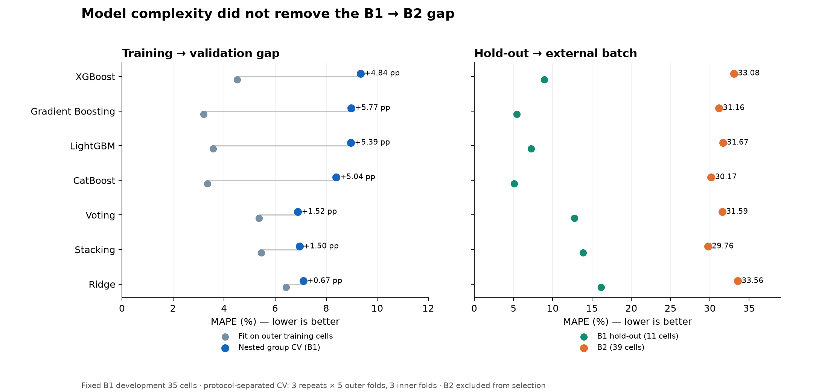

# 부스팅·앙상블 비교

초기 100사이클 특징과 기존 제공 수명 라벨을 유지해 모델 복잡도가 B1→B2 오차를 줄이는지 비교했다. B1 학습 35셀·Hold-out 11셀, B2 39셀, B3 44셀을 동일하게 사용했다.

## 검증 방법

- B1 학습 셀에서 충전 프로토콜을 분리한 5-fold 외부 CV를 3회 반복했다. 내부 3-fold CV에서 입력 1/2/3개와 하이퍼파라미터를 선택했다. 외부 평가 셀은 전처리·설정 선택·학습에 참여하지 않았다.
- 부스팅 4종은 각 입력 조합당 12개 설정을 탐색했다. 깊이 1–3, 트리 수 100/250, 학습률 0.03/0.07을 사용하고 각 알고리즘의 규제를 적용했다. 테스트를 사용한 조기 종료는 사용하지 않았다.
- 모든 후보는 로그 수명을 학습하고 사이클 단위로 역변환했다. 기존 Ridge의 alpha=1과 Stacking 결합 Ridge의 alpha=1은 비교 전 고정했다. Stacking의 기반 XGBoost 설정은 각 외부 학습 부분 안에서 다시 선택하고, 결합 모델은 프로토콜별 내부 OOF 예측으로 학습했다.
- 모델 선정 기준은 B1 반복 외부 OOF MAPE 평균이다. B1 Hold-out/B2/B3는 선정 후 동일 저장 모델로 평가했다.
- 표의 **학습**은 각 외부 학습 부분에 다시 예측한 오차이고, **B1 CV**는 해당 모델이 보지 않은 셀의 예측 오차다. 과적합 격차는 CV−학습(%p)이다. 과제 성능 표의 Train은 B1 CV를 사용한다.

## 결과

MAPE(%): 낮을수록 더 정확하다.

| 모델 | 학습 | B1 CV | CV−학습 (%p) | B1 Hold-out | B2 | B3 |
|---|---:|---:|---:|---:|---:|---:|
| OLS — ΔQ 단독 | 6.98 | 7.51 | 0.53 | 18.20 | 28.86 | 12.59 |
| OLS — 2변수 | 6.40 | 7.16 | 0.77 | 16.70 | 32.65 | 13.40 |
| 기존 Ridge | 6.43 | 7.10 | 0.67 | 16.15 | 33.56 | 13.74 |
| 튜닝 Ridge | 6.65 | 7.68 | 1.03 | 16.15 | 33.56 | 13.74 |
| XGBoost | 4.51 | 9.35 | 4.84 | 8.94 | 33.08 | 17.16 |
| CatBoost | 3.35 | 8.39 | 5.04 | 5.11 | 30.17 | 14.07 |
| LightGBM | 3.58 | 8.97 | 5.39 | 7.24 | 31.67 | 17.14 |
| Gradient Boosting | 3.20 | 8.98 | 5.78 | 5.41 | 31.16 | 14.06 |
| Stacking — Ridge 결합 | 5.46 | 6.96 | 1.50 | 13.83 | 29.76 | 13.06 |
| **Voting — 단순 평균** | **5.37** | **6.89** | **1.52** | **12.74** | **31.59** | **13.12** |



## 선정 및 해석

이번 탐색 범위의 B1 CV 최저 후보는 **Voting**이다. ΔQ 단독 OLS·2변수 Ridge·선택 XGBoost의 사이클 단위 예측을 같은 비중으로 평균한다. CV 6.893%와 학습 5.374%의 차이는 1.519%p로 부스팅 단독 모델보다 작다. 다만 Stacking의 6.960%와 차이는 0.067%p뿐이며, 반복 CV의 표준편차는 Voting 0.294%p·Stacking 0.117%p다. 반복 분할은 서로 겹치므로 통계적으로 독립된 표본이나 신뢰구간으로 해석하지 않는다. 확정적인 성능 우위나 과적합 부재를 주장할 수 없다.

부스팅 중 최저는 **CatBoost**지만 CV−학습 격차가 5.040%p다. Hold-out 11셀의 5.108%만 보고 모델을 선정하면 분할 특성에 의존할 수 있다. 선택 설정은 깊이 1, 250트리, 학습률 0.07, L2 규제 10이며 ΔQ 로그분산과 충전 RMS를 사용한다.

Voting의 B2 31.592%는 과제 Target 9.1%보다 22.492%p 높다. 부스팅을 사용해도 배치 일반화 문제가 해소되지 않았다. B1에는 500회 미만 수명이 없고 B2에는 28/39셀이 있어 내부 CV가 이 수명 영역을 검증할 수 없다. 전류 RMS–수명 상관은 B1 −0.891/B2 −0.207로 달라지는 반면 ΔQ 상관은 −0.886/−0.902로 유지된다. 제공 B1 라벨 중 미완료 기록 문제도 별도로 남아 있다.

앞선 실험은 XGBoost 설정 선택과 앙상블 비교에 같은 B1 개발 데이터를 사용했다. 이번 실험은 매 외부 학습 부분에서 설정을 다시 선택했고 최종 XGBoost도 200트리에서 250트리로 달라졌다. 따라서 앞선 Stacking B2 27.591%와 이번 29.764%는 서로 다른 설정의 실험이며, 이전 결과를 덮어쓰지 않았다. B2/B3는 이전 EDA·실험에서 이미 확인했으므로 새로 확보한 미관측 배치와 구분한다.

## 재현·검증

```bash
pip install -r requirements-comparison.txt
python -m src.compare_boosting --output results/runs/new_boosting_selection
```

현재 macOS 가상환경에서 사용한 명령:

```bash
DYLD_LIBRARY_PATH="../.venv/lib/python3.11/site-packages/sklearn/.dylibs" ../.venv/bin/python -m src.compare_boosting --output results/runs/new_boosting_selection
```

실험 계산 시간은 약 53초(설치·작성·검증 제외)였다. 저장 모델 10개를 다시 읽고 외부 분할 모델 150개를 재학습해 예측·지표를 재계산했다. 프로토콜 분리와 기존 모델·라벨·성능 파일의 SHA256 보존을 확인했다. 기존 기본 모델은 변경하지 않았다.

- `model_comparison.csv`: 모든 후보 성능.
- `selected_model_performance.csv`: 과제 양식의 선정 모델 점수·Gap.
- `outer_oof_predictions.csv`, `outer_fold_results.csv`, `outer_split_manifest.csv`: 중첩 평가 증거.
- `selected_models.json`, `protocol.json`, `runtime.json`, `verification.json`: 선정 기준·설정·환경·검증.

[중첩 CV 설명](https://scikit-learn.org/stable/auto_examples/model_selection/plot_nested_cross_validation_iris.html)
