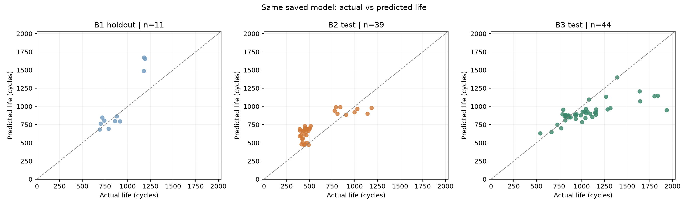

# ESS 배터리 수명 예측

ESS의 배터리 교체와 상태 점검을 미리 계획하기 위해 초기 관측으로 수명을 예측합니다.
처음100사이클의 용량 곡선과 충전 전류를 사용해 제공된 전체 `cycle_life`를 예측하는 회귀 문제입니다.

## 프로젝트 개요

- 데이터: MIT-Stanford Battery Dataset, [과제 원본 Kaggle](https://www.kaggle.com/datasets/itshpark/data-driven-prediction-of-battery-cycle).
- 학습: Batch1=2017-05-12, 유효 수명46개 중 학습35개/holdout11개.
- 필수 평가: Batch2=2018-02-20, 유효 수명39개. 추가 평가: Batch3=2018-04-12,44개.
- 제외: 2018-04-03. 수명 결측10개를 관측 길이로 채우지 않습니다.
- 태스크: Regression. 입력은 초기 특징, 정답은 원본 MAT의 `cycle_life`입니다.

## 파이프라인


‘파일 확인’은 지정한 배치를 읽었는지, ‘셀 ID 확인’은 특징과 정답이 같은 셀인지 확인하는 작업입니다. 예를 들어 B1c20의 특징에 B1c21의 수명을 연결하면 안 됩니다. [단계별 설명](docs/pipeline.md)

## 파일 구조

```text
├── data/
│   ├── README.md                  # 원본 링크·파일명·배치 방법
│   ├── raw/                       # 원본 MAT 로컬 위치, Git 제외
│   └── processed/cell_features.csv
├── notebooks/
│   ├── 01_EDA.ipynb
│   ├── 02_feature_engineering.ipynb
│   └── 03_modeling.ipynb
├── src/
│   ├── preprocess.py              # 기존 원본 읽기
│   ├── features.py                # 초기 ΔQ·RMS·MAD
│   ├── splits.py                  # 충전 프로토콜 그룹 분할
│   ├── train.py                   # CV 선택·학습
│   ├── evaluate.py                # 저장 모델 평가·지표
│   ├── report.py                  # 도표·오류 분석·보고서
│   ├── pipeline.py                # 단계별 실행
│   └── eda/                       # 기존 DAY1 분석 코드
├── config/model.json
├── results/                       # 기존 EDA와 실행 후 결과
├── models/                        # 학습 실행 후 저장 모델
├── docs/
├── requirements.txt
└── README.md
```

## 환경과 실행

Python3.11 이상을 권장합니다. 원본 특징 추출·모델 학습·Batch 1 Hold-out 및 Batch 2/3 평가·보고서 생성을 수행했습니다. 아래 명령으로 각 단계를 재현할 수 있습니다.

노트북은 `01_EDA → 02_feature_engineering → 03_modeling` 순서로 구성했습니다. 노트북이 `src`의 함수를 호출하므로 `.py`를 별도로 실행할 필요는 없습니다. 저장된 출력으로 기존 실험을 확인할 수 있으며, 이미 끝낸 학습·평가를 같은 결과 폴더에 다시 실행하면 덮어쓰기 방지 오류가 발생합니다.

```bash
git clone https://github.com/dwk0714/ESS_Analytics_SKALA.git
cd ESS_Analytics_SKALA
python -m venv .venv
source .venv/bin/activate
pip install -r requirements.txt
jupyter lab
```

원본 전체 재현은 [데이터 안내](data/README.md)에 따라 MAT를 준비합니다. 현재 기존 `../archive`를 그대로 지정할 수 있습니다.

```bash
# 전체 EDA: 원본 필요, 모델 학습 없음
python -m src.pipeline eda --raw-dir ../archive
# 모델용 초기 특징: 원본 필요
python -m src.pipeline features --raw-dir ../archive
# 새 실험 재현: 동봉 특징 CSV를 사용하고 별도 결과 폴더에 저장
python -m src.pipeline train --run-dir results/runs/reproduction
python -m src.pipeline evaluate --run-dir results/runs/reproduction --include-b3
python -m src.pipeline report --run-dir results/runs/reproduction
```

위 명령은 노트북 대신 터미널로 실행하는 방법입니다. B3 평가를 생략하려면 첫 평가 명령에서 `--include-b3`를 뺍니다. 새 실험마다 다른 폴더 이름을 정하고 학습·평가·보고서에 같은 `--run-dir`를 지정합니다. 기존 평가 결과를 덮어쓰거나 B2 결과로 재튜닝하지 않습니다.

## EDA

### Cycle Life 분포

히스토그램은 150~2,300사이클 범위로 표시했습니다. 유효 수명129개의 실제 범위는392~1,935사이클입니다. 아래 비율은 각 배치의 유효 수명 수를 기준으로 계산했습니다.

| 배치 | 유효 수명 n | 중앙값 (cycle) | 단수명 <500 | 장수명 >1,000 |
|---|---:|---:|---:|---:|
| B1 | 46 | 858.5 | 0 (0.0%) | 10 (21.7%) |
| B2 | 39 | 472.0 | 28 (71.8%) | 3 (7.7%) |
| B3 | 44 | 1,005.5 | 0 (0.0%) | 23 (52.3%) |

- B1은 중앙부에 모이고 B2·B3는 오른쪽 꼬리가 긴 분포입니다. B2는 단수명, B3는 장수명 비중이 큽니다.
- B2의 최단 셀은 B2c19(392사이클)입니다. 단수명28개는 배치 내 다수이며 IQR 하단 이상치가 아닙니다. 짧다는 이유만으로 측정 오류로 판단하지 않았습니다.
- **핵심 발견:** 학습 배치와 평가 배치의 수명 분포가 달라, 배치 간 일반화를 별도로 평가해야 합니다.


### 열화 곡선 분석

- 배치별 최단·최장 수명 셀을 대표로 골라 Qd 추이를 비교했습니다. 상대적으로 짧은 수명 셀에서 후기 용량 감소가 더 빨랐습니다.
- 분절 회귀로 탐색한 Knee 후보의 배치별 중앙값은 B1 611 / B2 355 / B3 832사이클입니다. 이 집계는 수명 결측 셀도 포함한 전체 곡선 EDA 기준입니다.
- B2c19의 Knee 후보는308사이클, B2c34(1,186사이클)의 후보는961사이클입니다. Knee는 전체 곡선에서 사후 탐색한 후보이며 초기 예측 입력에 넣지 않았습니다.
- **핵심 발견:** 열화는 일정한 속도로 진행되지 않으며, 초기 총용량 변화가 작아도 후기 감소가 가속될 수 있습니다.

[열화 곡선과 Knee 도표](results/eda/knee/knee_representative_fits.png)

### ΔQ(V) 곡선 분석

- 같은 전압축(3.5→2.0V, 1,000점)에서 `ΔQ(V)=Q100(V)−Q10(V)`를 계산했습니다.
- 단수명군(<500)의 ΔQ 로그 분산 중앙값은−3.446, 장수명군(>1,000)은−4.311입니다. 단수명군에서 전압별 변화 폭이 더 컸습니다. 단수명군은 B2에만 있어 전체 장단수명 비교에는 배치 효과도 포함됩니다.
- **핵심 발견:** 초기 총용량보다 전압별 용량 곡선의 변화가 수명을 구분하는 강한 신호였습니다. 곡선 형태를 로그 분산으로 요약했습니다.

[장단수명 ΔQ 형태 비교](results/eda/delta/delta_life_group_shapes.png)

### 충전 속도(C-rate)와 수명의 관계

- B1의 `5.4C(60%)-3.6C` 평균 수명은859.5사이클(n=2), `5.4C(80%)-5.4C`는546.5사이클(n=2)입니다. 초기 C-rate가 같아도 전환 SOC와 후반 전류가 다르면 수명이 달랐습니다.
- cycle10 실측 RMS와 수명의 Pearson r은 B1−0.891 / B2−0.207 / B3−0.507입니다. 관계의 강도가 배치별로 달랐습니다.
- **핵심 발견:** 최고 C-rate 하나로 수명을 설명하기 어렵습니다. 실제 전류 크기와 적용 시간 비중을 반영하는 시간 가중 RMS를 후보로 선정했습니다. 상관을 충전 조건의 인과 효과로 단정하지 않았습니다.

[프로토콜별 평균 수명과 표본 수](results/eda/summary/06_policy_life_with_n.png)

### 추가 확인: 수명 상관과 다중공선성

아래 값은 원본 `cycle_life`와 각 초기 특징의 Pearson 상관계수입니다.

| 초기 특징 | 전체129개 | B1 | B2 | B3 |
|---|---:|---:|---:|---:|
| ΔQ 로그 분산 | −0.851 | −0.886 | −0.902 | −0.702 |
| cycle10 시간 가중 RMS | −0.432 | −0.891 | −0.207 | −0.507 |
| 상대 용량 MAD | −0.522 | −0.487 | −0.490 | −0.350 |

- ΔQ 로그 분산은 세 배치에서 일관된 음의 관계를 보였습니다. 로그 절대 최솟값은 로그 분산과 r≈0.968로 중복돼 함께 사용하지 않았습니다.
- B1 학습35개에서3후보를 함께 진단한 VIF는 ΔQ 4.881 / RMS 5.130 / MAD 1.481입니다. 연관된 입력의 계수 불안정을 줄이기 위해 Ridge의 L2 규제를 적용했습니다.
- **핵심 발견:** 수명과의 개별 상관이 높아도 중복 변수를 늘리지 않았고, 최종 채택 여부는 B1 내부 CV로 확인했습니다.

상세 계산과 도표는 [EDA 노트북](notebooks/01_EDA.ipynb), [상관 분석 결과](results/eda/feature_plots/feature_target_correlations.csv), [DAY1 보고서](docs/DAY1_EDA_Modeling_Strategy.pdf)에 정리했습니다.

**Batch 2는 분포가 다른 배치에서도 예측이 유지되는지 확인하기 위해 최종 평가에 사용했습니다.** 분포 차이만으로 유효 단수명 셀을 제거하지 않았습니다. B2/B3를 DAY1 EDA에서 확인한 이력은 분석 한계로 남겼습니다.

## Modeling

### 피처 엔지니어링 전략

실제100사이클을 관측한 시점에서 제공된 전체 `cycle_life`를 예측했습니다. ID·배치·정책은 분할과 연결 확인에 사용하고, 후기 Knee·전체 생애 기울기·최종 용량은 입력에서 제외했습니다.

| 특징 | 계산 방법 | EDA 근거와 선정 이유 | 최종 적용 |
|---|---|---|---|
| `dq100_10_log_variance` | `log10(var(Q100(V)−Q10(V), ddof=1))` | 전압별 초기 곡선 변화 폭을 요약하며 배치별 수명 관계가 일관됐습니다. | 선정 |
| `cycle10_rms_c_timeweighted` | cycle10 활성 충전 구간의 시간 가중 전류 제곱평균에 제곱근 | 최고 전류만으로 놓치는 실제 충전 전류 크기와 시간 비중을 반영했습니다. | 선정 |
| `capacity_mad_relative` | 초기 Qd2~100의 MAD ÷ 유효 Qd2~10 중앙값 | 극단값에 덜 민감한 초기 용량 변동을 요약하고 추가 예측 가치를 비교했습니다. | 미선정 |

학습 표본35개와 후보 간 중복을 고려해 **기본2변수와 MAD 추가3변수만 비교**했습니다. 각 구성의 최적 CV MAPE는2변수6.987%(alpha=1), 3변수7.114%(alpha=0.1)로, 이번 실험에서는2변수 구성을 선정했습니다. 이 결과가 모든 데이터에서 MAD가 불필요하다는 뜻은 아닙니다.

### 모델 선택 및 근거

| 후보 모델 | 검토 이유 | 이번 선택 |
|---|---|---|
| Ridge | 적은 수치형 입력에 적합하고 L2 규제로 연관된 계수를 안정화합니다. 주요 조정값은 alpha입니다. | 최종 선정 |
| ElasticNet | L1/L2 규제로 변수 제거가 가능하지만2~3입력에서는 추가 이점이 확인되지 않았습니다. | 후속 선형 대안 |
| Boosting | 비선형·상호작용을 학습할 수 있으나 트리 수·깊이·학습률 등의 선택 부담이 있습니다. | 후속 비교 후보 |
| 소형 MLP | 비선형 모델이지만 현재 소표본에서 복잡도를 높일 이점이 확인되지 않았습니다. | 후속 비교 후보 |

최종 모델은 **표준화 + Ridge(alpha=1) + log10 수명 변환**입니다. 후보 계열은 데이터 규모·입력 구조·효율을 검토한 목록이며, 다른 계열을 실제 학습해 Ridge의 성능 우위를 입증한 비교는 아닙니다.

- **선정 이유:** 작은 학습 표본과 연관된 입력에서 계수 불안정을 줄이고, 적은 설정으로 학습·해석할 수 있습니다.
- **효율·비용:** 로컬 CPU에서2구성×7alpha×5fold=70회와 최종 학습1회, 총71회를 수행했습니다. 특징 추출을 제외한 학습 단계 실측 시간은 약0.213초이며 GPU·유료 API를 사용하지 않았습니다.
- **구현 위치:** [src/train.py의 make_model](src/train.py#L37)에서 Ridge를 구성하고, [최종 학습](src/train.py#L96)에서 `.fit()`을 호출했습니다. [03_modeling.ipynb](notebooks/03_modeling.ipynb)가 이 학습 함수를 실행했습니다.

```python
regression = Pipeline([
    ("preprocess", select_and_scale),
    ("ridge", Ridge(alpha=alpha, solver=solver)),
])
```

선택된 입력·alpha·계수는 [모델 설정](models/metadata.json), 학습 객체는 `models/ridge.joblib`, 후보별 점수는 [CV 비교표](results/cv_search_results.csv)에 저장했습니다.

모델 설정 파일은 학습 시점의 기록입니다. 이후 B1 Hold-out·B2·B3 평가 완료 여부와 점수는 [평가 기록](results/evaluation.json)에 저장했습니다.

### 학습·검증·평가 방법

- B1을 충전 프로토콜 그룹으로 학습35개/holdout11개로 분리했습니다. 같은 프로토콜의 반복 셀이 양쪽에 섞이지 않게 했습니다.
- 학습35개 내부의 그룹5-fold CV에서 특징 구성과 alpha를 선택했습니다. 표준화는 각 fold의 학습 부분에서만 수행했습니다.
- `log10(cycle_life)`를 학습하고 `10**예측`으로 역변환한 뒤 원래 수명 단위에서 평가했습니다.
- 선택 후 학습35개로 만든 **동일 저장 모델**을 B1 holdout·B2·B3에 적용했습니다. 평가셋으로 특징·alpha를 재선택하거나 전체 B1로 재학습하지 않았습니다.

## 성능 결과

**MAPE가 낮을수록 수명 예측이 더 정확합니다.** 수명이 다른 셀의 상대 오차를 비교하고 논문 Target9.1%와 대조하기 위해 주 지표로 사용했습니다. MAE는 평균 몇 사이클 틀렸는지, RMSE는 큰 오차의 영향을 확인하는 보조 지표입니다. `100−MAPE`를 Accuracy로 해석하지 않았습니다.

성능 행의 단위는%, Gap 행의 단위는%p입니다. 양수 Gap은 뒤 평가의 오차 증가를 뜻합니다. Train은 학습35개 내부의 그룹 CV 점수이며, 학습 자료에 재대입한 성능이 아닙니다.

| 구분 | MAPE (%) | 비고 |
|---|---:|---|
| Train (Batch 1 CV) | 6.987 | 선택 후보 그룹 CV |
| Valid (Batch 1 Hold-out) | 16.153 | B1 holdout |
| Test (Batch 2) | 33.561 | 최종 배치 평가 |
| Gap (Train-Valid) | +9.167 | Valid−Train, (+) 오차 증가 |
| Gap (Valid-Test) | +17.407 | Test−Valid, (+) 오차 증가 |
| Gap (Target-Test) | +24.461 | Test−9.1, Target: 논문9.1% |
| Test (Batch 3) | 13.742 | 동일 모델 추가 평가 |
| Gap (Batch2-Batch3) | −19.819 | B3−B2 |
| Gap (Target-Test) [Batch 3] | +4.642 | B3−9.1, 추가 참고 비교 |

| 평가 구분 | MAE (cycle) | RMSE (cycle) | 중앙 수명 기준 모델 MAPE (%) |
|---|---:|---:|---:|
| Train (Batch 1 CV) | 58.389 | 75.104 | 20.244 |
| Valid (Batch 1 Hold-out) | 165.652 | 234.920 | 16.488 |
| Test (Batch 2) | 166.675 | 183.679 | 72.400 |
| Test (Batch 3) | 173.457 | 269.477 | 20.232 |

중앙 수명 기준 모델은 CV에서 각 fold 학습 정답의 중앙값, 나머지 평가에서는 학습35개 정답의 중앙값을 예측합니다.

- **B2는 논문 Target9.1%에 미달**했으며 차이는+24.461%p입니다. 단순 중앙 수명 기준72.400%보다 개선됐지만 배치 일반화 오차가 큽니다.
- Valid MAPE16.153%는 기준 모델16.488%와 차이가 작고, MAE·RMSE는 기준 모델보다 큽니다. CV의 좋은 점수만으로 일반화 성능을 판단하지 않았습니다.
- B3 MAPE13.742%는 B2보다 낮습니다. 다만 일부 장수명 셀의 큰 과소 예측이 남아 있습니다.



[요구 형식 성능표](results/model_performance.csv) · [보조 지표와 기준 모델](results/model_metrics.csv) · [성능 보고서](results/performance_report.md)

## 오류 분석

각 평가셋의 APE 상위3개 셀을 비교했습니다. 아래는 평가셋별 최대 상대 오차 사례입니다.

| 평가셋 | 셀 | 실제 수명 | 예측 수명 | APE (%) | 관찰 |
|---|---|---:|---:|---:|---|
| B1 Hold-out | B1c1 | 1,179 | 1,670.9 | 41.72 | 선택 입력2개 모두 학습 범위 밖, 과대 예측 |
| B2 | B2c6 | 393 | 691.2 | 75.89 | 선택 입력은 학습 범위 안이지만 과대 예측 |
| B3 | B3c38 | 1,935 | 949.4 | 50.94 | 선택 입력은 학습 범위 안이지만 과소 예측 |

- **공통점:** B2 상위3개 오류 셀(B2c6·B2c15·B2c18)은 모두500사이클 미만의 단수명 셀이고 수명을 과대 예측했습니다. B3 상위3개는1,801~1,935사이클의 장수명 셀을 과소 예측했습니다. B1 Hold-out 상위3개는 모두 `3.6C(80%)-3.6C` 프로토콜이며 선택 입력이 학습 범위 밖입니다.
- **원인 가설:** B1에 없는500미만 단수명 영역, 배치별 특징–수명 관계와 라벨 종료 규칙 차이,2개 요약 입력의 정보 한계가 영향을 줬을 가능성이 있습니다. 입력 범위 안이라는 사실만으로 예측 관계가 다른 배치에서도 유지되지는 않았습니다.
- **개선 방향:** 종료 기준과 데이터 품질을 먼저 대조하고, 전환 SOC·고전류 유지 비중 등 추가 초기 특징의 가치를 B1 내부 그룹 CV에서 비교합니다. 수명 범위를 넓힌 학습 자료와 새로운 외부 배치로 개선 효과를 검증합니다. 현재 B2 결과는 기존 모델의 평가 결과로 유지합니다.

[전체9개 오류 사례와 품질 정보](results/error_analysis.md) · [셀별 예측](results/predictions.csv)

## ESS 도메인 해석

- **의사결정 활용:** 현장 검증을 거친다면 셀 상태 점검의 우선순위, 교체 일정과 예비품 계획, 충전 전략 검토에 활용할 수 있습니다. B2의 수명 과대 예측은 점검·교체를 늦출 위험과 연결되므로 오차 방향도 함께 확인해야 합니다.
- **현재 한계:** 실험실 셀의 제공 `cycle_life`를 예측했으며 운영 연수·RUL·확정 교체 시점으로 바로 환산할 수 없습니다. B1/B3 라벨은 마지막 관측cycle+1, B2 유효 라벨은 최초Qd<0.88Ah와 대응합니다. 파일 간 물리적 셀 동일성은 미확인이고 B2/B3는 DAY1 EDA에 사용했습니다.
- **실제 배포에 필요한 것:** 현장 온도·SOC·부하·calendar aging·팩 불균일성 데이터, 일관된 EOL 기준, 외부 배치 검증과 예측 불확실성 평가가 필요합니다. 교체비 절감 효과는 이번 실험에서 측정하지 않았습니다.

논문9.1%는 과제의 비교 Target입니다. 이번 데이터 구성·분할·라벨 규칙이 다르므로 동일 조건의 논문 재현 성능으로 해석하지 않았습니다.

## 참고문헌

- Severson et al. (2019). [Data-driven prediction of battery cycle life before capacity degradation](https://web.mit.edu/braatzgroup/Severson_NatureEnergy_2019.pdf). *Nature Energy*, 4, 383–391.
- [Ridge](https://scikit-learn.org/stable/modules/generated/sklearn.linear_model.Ridge.html), [GroupKFold](https://scikit-learn.org/stable/modules/generated/sklearn.model_selection.GroupKFold.html), [MAPE](https://scikit-learn.org/stable/modules/generated/sklearn.metrics.mean_absolute_percentage_error.html).

## 팀 구성

- 김동욱: EDA·피처 엔지니어링·모델 전략 수립·파이프라인 구현·Ridge 모델 개발·성능 평가(Batch2·Batch3)·도표 및 보고서 작성.
