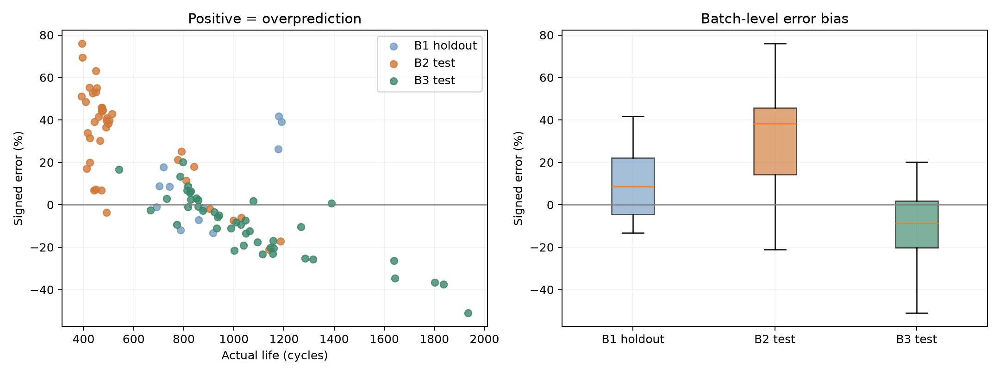
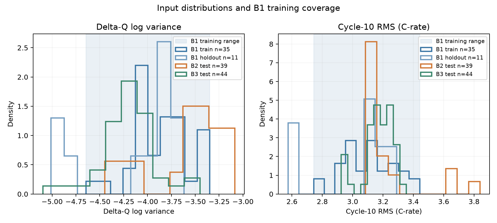

# 성능 결과

MAPE가 낮을수록 수명 예측이 더 정확합니다. Gap의 단위는%p이며 양수는 뒤 평가의 오차 증가입니다.

| 구분 | MAPE (%) | 비고 |
| --- | --- | --- |
| Train (Batch 1 CV) | 6.987 | 선택 후보의 그룹 CV; 낮을수록 예측이 더 정확함 |
| Valid (Batch 1 Hold-out) | 16.153 | B1 holdout; 동일 저장 모델 |
| Test (Batch 2) | 33.561 | 필수 최종 배치 평가 |
| Gap (Train-Valid) | 9.167 | Valid−Train (%p); (+) 과적합/집단 차이 검토 |
| Gap (Valid-Test) | 17.407 | Test−Valid (%p); (+) 배치 간 일반화 저하 검토 |
| Gap (Target-Test) | 24.461 | Test−9.1 (%p); 논문 Target과 다른 실험 구성 |
| Test (Batch 3) | 13.742 | 동일 모델 추가 평가 |
| Gap (Batch2-Batch3) | -19.819 | B3−B2 (%p); (+) B3에서 오차 증가 |
| Gap (Target-Test) [Batch 3] | 4.642 | B3−9.1 (%p); 추가 참고 비교 |

## 보조 지표와 중앙 수명 기준 모델

| scope | model | MAPE_percent | MAE_cycles | RMSE_cycles | n |
| --- | --- | --- | --- | --- | --- |
| train_cv | Ridge | 6.987 | 58.389 | 75.104 | 35 |
| valid | Ridge | 16.153 | 165.652 | 234.920 | 11 |
| test_b2 | Ridge | 33.561 | 166.675 | 183.679 | 39 |
| test_b3 | Ridge | 13.742 | 173.457 | 269.477 | 44 |
| train_cv | Training median | 20.244 | 154.043 | 190.216 | 35 |
| valid | Training median | 16.488 | 154.818 | 192.923 | 11 |
| test_b2 | Training median | 72.400 | 341.051 | 364.606 | 39 |
| test_b3 | Training median | 20.232 | 251.341 | 370.602 | 44 |

MAE는 평균 사이클 오차, RMSE는 큰 오차의 영향을 보여줍니다. 중앙 수명 기준값은 CV에서 각 fold 학습 정답의 중앙값, Valid/B2/B3에서 학습35개 정답의 중앙값입니다.

## 해석 범위

Train은 모델 선택에 사용한 그룹 CV 점수이며 재대입 성능이 아닙니다. B2/B3는 DAY1 EDA에서 확인했으므로 완전히 미관측한 개발 외부 자료는 아닙니다. 논문9.1%는 과제 참고 Target이며, 이번 코호트·분할·라벨 규칙으로 정확한 논문 재현을 주장하지 않습니다.

[큰 오차 사례](error_analysis.md)
